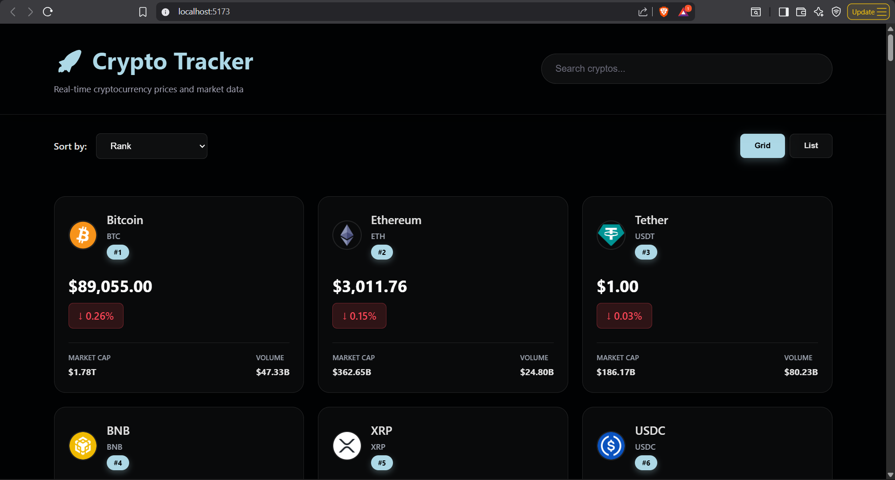

# 🪙 Crypto Tracker

A modern cryptocurrency tracker built with **React 19** and **Vite**, allowing users to track real-time crypto prices, view interactive charts, and explore detailed coin information using the **CoinGecko API**.

## ⚙️ Tech Stack

- **React 19** – Modern React with hooks
- **Vite** – Fast development server and build tool
- **JavaScript (ES6+)** – Core application logic
- **Recharts** – Beautiful charts and data visualization
- **CoinGecko API** – Real-time cryptocurrency data
- **CSS3** – Responsive styling and UI design

---

## ⚡️ Features

- 📊 **Real-Time Prices** – Live cryptocurrency market data
- 📈 **Interactive Charts** – 7-day price charts using Recharts
- 🔍 **Coin Details** – Detailed information for each cryptocurrency
- 🎯 **Dynamic Routing** – Navigate to individual coin pages
- 💰 **Market Data** – Market cap, volume, and price changes
- 📱 **Responsive UI** – Works on all screen sizes

---

## 🖼️ Screenshots



## ⚙️ Setup & Installation

### 1️⃣ Clone this repository

```bash
git clone https://github.com/hadishah123/crypto-tracker.git
cd crypto-tracker
```

### 2️⃣ Install dependencies
```bash
npm install
```
  ### 3️⃣ Run the server
```bash
npm run dev
```
### 4️⃣ Open your browser
```bash 
➡️ http://localhost:5173
```
  
## 🤝 Contributing
  
Pull requests are welcome!  
For major changes, please open an issue first to discuss what you’d like to change.
  
---
## 🪪 License
  
MIT License © 2026 [Hadi Shah](https://github.com/hadishah123)